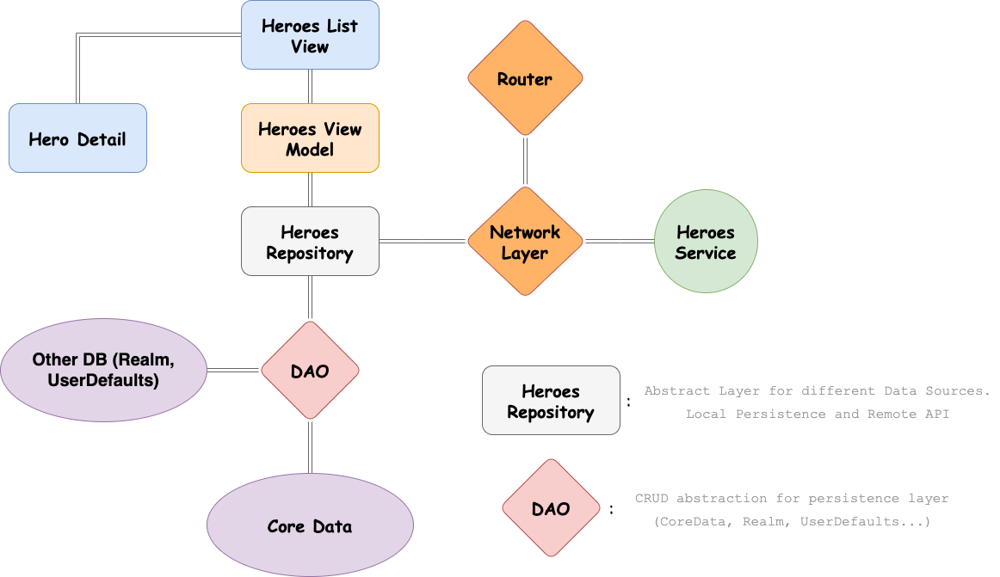
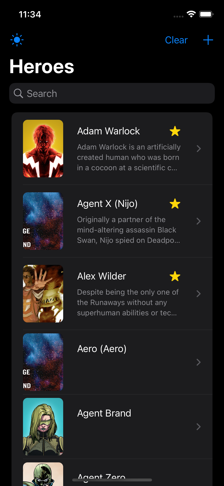

  

## Overview

iOS 15 Client for Marvel API with the following features:

- MVVM
- Abstract Network Layer
- SwiftUI
- Async/Await
- Theme Switcher
- Core Data persistence with Async/Await approach + One To Many Relatinshop
- DAO, Repository and Dependency Injection Design Patterns
- Unit Testing: Network Layer, CoreData DAO, Repository, JSON Decodable

## Set-Up

1. Register in https://developer.marvel.com/ 
2. Replace Private and Public Key variables in /APIService/Router.swift
3. Install Swiftlint via `brew install swiftlint`
4. Xcode 13 should be installed

## Architecture

  

 Dependencies installed via SwiftPM:
- [Backed Decobale](https://github.com/jegnux/BackedCodable) property wrappers for nested JSON.
- [OHTTPS:](https://github.com/AliSoftware/OHHTTPStubs) framework for stubbing network requests.
- [Swiftlint:](https://github.com/realm/SwiftLint) linter for cleaner code.
- [CachedAsyncImages:](https://github.com/lorenzofiamingo/swiftui-cached-async-image) Wrapper for Apple’s AsyncImage class
     to cache images.

## View Use Cases

-	Get Heroes
-	Pagination
-	Delete Hero via Swipe
-	Delete All Heroes
-	Make Favorite Heroes
-	Sort Heroes by Favorite & Name
-	Pull to Refresh
-	Loading State
-	No Internet Connection Pop-Up
-	Empty State
-	Persistent Data

## Screenshots

